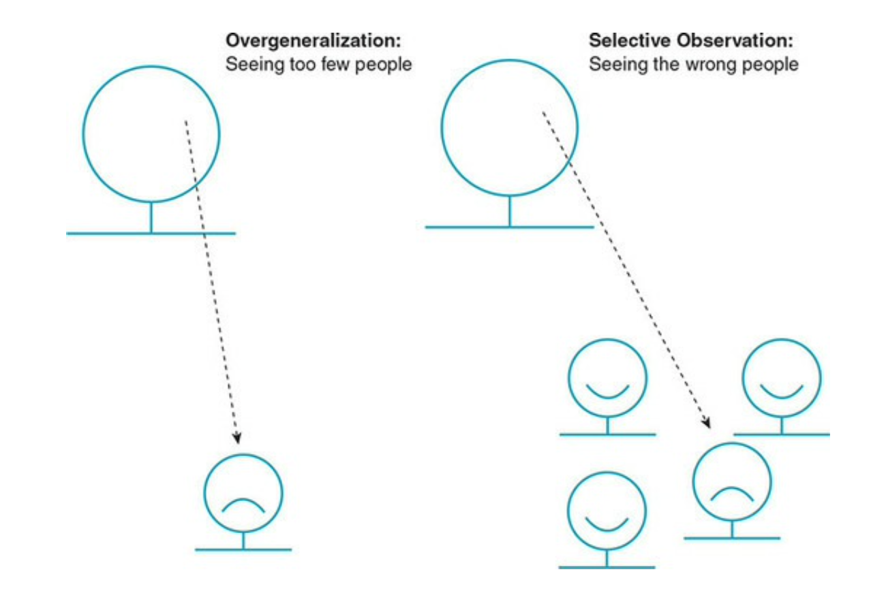
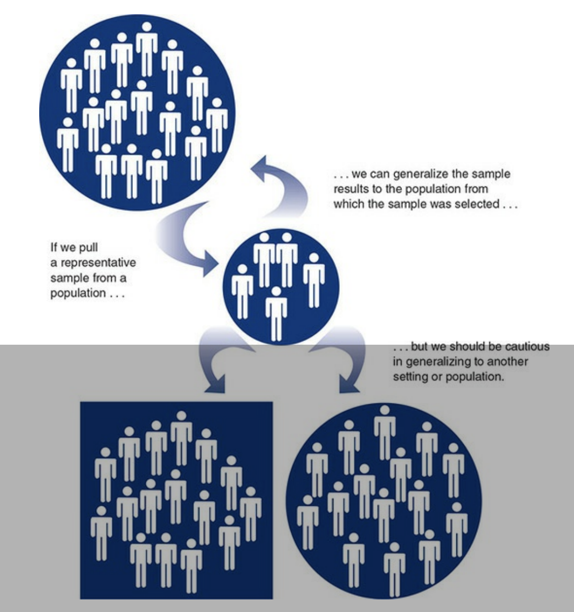
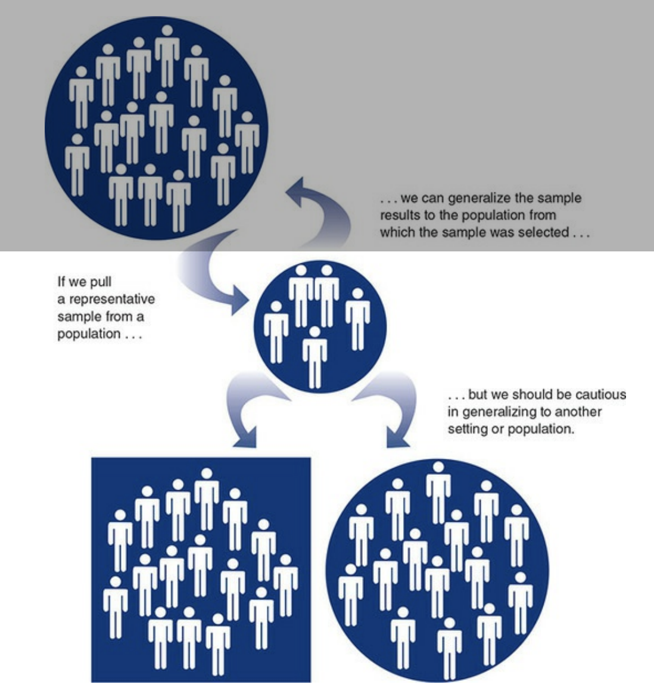

```{r setup, include=FALSE}
options(htmltools.dir.version = FALSE)
knitr::opts_chunk$set(collapse = TRUE,
                      fig.retina = 3,
                      echo = FALSE)
library(countdown)
library(ymlthis)
library(tidyverse)
library(magick)
library(icon)
library(xaringanExtra)
xaringanExtra::use_tachyons()
xaringanExtra::use_tile_view()
xaringanExtra::use_webcam()
xaringanExtra::use_fit_screen()
xaringanExtra::use_extra_styles(hover_code_line = TRUE, mute_unhighlighted_code = TRUE)
xaringanExtra::use_share_again()

```

layout: true

---

class: title-slide, hide-count, center, hide-logo

background-image: url("https://images.unsplash.com/photo-1444703686981-a3abbc4d4fe3?ixid=MnwxMjA3fDB8MHxwaG90by1wYWdlfHx8fGVufDB8fHx8&ixlib=rb-1.2.1&auto=format&fit=crop&w=1770&q=80")
background-size: cover

```{r meta, echo=FALSE}
library(metathis)
meta() %>%
  meta_general(
    description = "Ajay Koli - Vishwakarma University",
    generator = "xaringan and remark.js"
  ) %>% 
  meta_name("github-repo" = "koliajaykr/plagiarism-zotero") %>% 
  meta_social(
    title = "Effective Citation & Referencing to avoid Plagiarism",
    url = "https://plag-zotero.netlify.app/",
    image = "https://plag-zotero.netlify.app/images/social-card.png",
    og_type = "talk",
    og_author = "Ajay Koli",
    twitter_card_type = "summary_large_image",
    twitter_creator = "@ajay_kolii"
  ) %>%
  include_meta()
```

<br>
<br>
<br>
# .big-text.white[`r rmarkdown::metadata$title`]

## .white.b[`r rmarkdown::metadata$subtitle`]

### .white.b[`r rmarkdown::metadata$author` | `r format(Sys.Date(), "%d %B %Y") `]

---
class: center, middle

.pull-left[
```{r , echo=FALSE, out.width="70%"}
library(magick)
magick::image_read("images/ajaykoli.png") 
```

`r icon::fa("twitter")`[@ajay_kolii](https://twitter.com/ajay_kolii) <br> 
`r icon::fa("envelope")`   [koliajaykumar@gmail.com](koliajaykumar@gmail.com)

]

.pull-right[
<br>
<br>
<br>
<br>

# Jai Bhim! `r emo::ji("blush")`
]

---

# STAR 

- STAR: Steps Towards Academic Research

- It is a free research methodology course as part of Corporate Social Responsibility (CSR) activity of Department of Travel & Tourism, [Vishwakarma University](https://www.vupune.ac.in/) - Pune, India, exclusively for the students of [Digital Nalanda](https://www.digitalnalanda.com/). 

- Its purpose is to encourage and train students to pursue research as a career.

- Free eBooks will be given and slides will be shared.

- Schedule:
  - Total sessions are eight
  - `r emo::ji("date")` 15 Dec 2021 to 07 Jan 2022; every Wednesday & Friday 
  - `r emo::ji("clock")` from 06:30 to 08:30 PM IST.


---

name: contents-slide

# Topics:

1. [Research Framework](#session1)

1. [Research Approaches](#session2)

1. [Ethics in Research](#session3)

1. [Sampling](#session4)

1. [Quantitative Methods & Analysis](#session5) 

1. [Qualitative Methods & Analysis](#session6) 

1. [Using R for Research Writing & Communication](#session7) 

---

class: middle, center

## .blue["in our everyday reasoning about the social world, prior experiences and orientations may have a major influence on what we perceive and how we interpret these perceptions.] ... 
--
.green[We need to move beyond first impressions and get reactions to more systematic methods of investigation. That’s what social research does."]<sup>2</sup>

---

# Science

- A set of logical, systematic, documented methods for investigating nature and natural processes; the knowledge produced by these investigations.<sup>2</sup>

```{r out.width="23%", fig.align='center'}
knitr::include_graphics("https://upload.wikimedia.org/wikipedia/commons/4/40/Tycho_instrument_sextant_mounting_19.jpg")
```

.footnote[
Image source: [Scientific instruments for measuring angles between two celestial bodies](https://upload.wikimedia.org/wikipedia/commons/4/40/Tycho_instrument_sextant_mounting_19.jpg)
]

---

# Social Science

- The use of scientific methods to investigate individuals, societies, and social processes; the knowledge produced by these investigations.<sup>2</sup>

```{r fig.align='center', out.width="45%"}
knitr::include_graphics("https://upload.wikimedia.org/wikipedia/commons/thumb/d/d7/1888-01-22%2C_La_Ilustraci%C3%B3n_Espa%C3%B1ola_y_Americana%2C_El_censo_de_poblaci%C3%B3n%2C_Alc%C3%A1zar.jpg/1920px-1888-01-22%2C_La_Ilustraci%C3%B3n_Espa%C3%B1ola_y_Americana%2C_El_censo_de_poblaci%C3%B3n%2C_Alc%C3%A1zar.jpg")
```

.footnote[
Image source: [Early censuses and surveys provided demographic data.](https://upload.wikimedia.org/wikipedia/commons/thumb/d/d7/1888-01-22%2C_La_Ilustraci%C3%B3n_Espa%C3%B1ola_y_Americana%2C_El_censo_de_poblaci%C3%B3n%2C_Alc%C3%A1zar.jpg/1920px-1888-01-22%2C_La_Ilustraci%C3%B3n_Espa%C3%B1ola_y_Americana%2C_El_censo_de_poblaci%C3%B3n%2C_Alc%C3%A1zar.jpg)
]


---

class: middle

background-image: url("https://media0.giphy.com/media/QvMlVkJ3XSSj9cOxDM/giphy.gif?cid=ecf05e47oubsluctl3i87lrsu1u6m58fbk4um5kjhni65zmj&rid=giphy.gif&ct=g")
background-size: 50%
background-position: 95% 50%

# Research Hell `r emo::ji("fire")` 

#  How to make it <br>`less` painful?

---

name: session1

class: title-slide, center, middle, inverse, hide-count, hide-logo

background-image: url("https://images.unsplash.com/photo-1606913079621-e64bd28682ba?ixlib=rb-1.2.1&ixid=MnwxMjA3fDB8MHxwaG90by1wYWdlfHx8fGVufDB8fHx8&auto=format&fit=crop&w=1740&q=80")
background-size: cover

<br>
<br>
<br>
<br>
<br>
<br>
<br>
<br>
<br>
<br>
<br>

# Session 1 <br> Research Framework


---

background-image: url("https://images.unsplash.com/photo-1517856497829-3047e3fffae1?ixid=MnwxMjA3fDB8MHxwaG90by1wYWdlfHx8fGVufDB8fHx8&ixlib=rb-1.2.1&auto=format&fit=crop&w=1738&q=80")
background-size: cover

.pull-left[
# Why research?

- "Research results in the .orange[creation of knowledge] to solve a problem, answer a question, and better describe or understand something."

.footnote[

Clough, P., & Nutbrown, C. (2012). A Student′ s Guide to Methodology. Sage. 

]

]

--

.pull-right[
# Find your reason:
  - education
  - better opportunities
  - curiosity
  - targets
  - policy critic
  - climate change
  - fame
  - human rights for all genders & castes
  - poverty alleviation
  - consumption
  - production
  - medicine
]


---
class: hide-logo

background-image: url("https://images.unsplash.com/photo-1558538337-aab544368de8?ixid=MnwxMjA3fDB8MHxwaG90by1wYWdlfHx8fGVufDB8fHx8&ixlib=rb-1.2.1&auto=format&fit=crop&w=1770&q=80")
background-size: cover

# .white.center[What is research?]
<br>
<br>
<br>
<br>
<br>
<br>
<br>
<br>
<br>
<br>

- .white[".red[is about .b[asking] questions, exploring problems] .green[and .b[reflecting] on what emerges in order to make meaning from the data] .blue[and tell the research .b[story]]"]

.footnote[

.white[Clough, P., & Nutbrown, C. (2012). A Student′ s Guide to Methodology. Sage. ]

]

---

# What is research?

- "questions about the world and a desire to accurately answer them" <sup>2</sup>

--

- "steps from broad assumptions to detailed methods of data collection, analysis, and interpretation" <sup>3</sup>

--

- "Just close your eyes for a minute and utter the word research to yourself."<sup>1</sup>

---
class: right

background-image: url("https://images.unsplash.com/photo-1490818387583-1baba5e638af?ixid=MnwxMjA3fDB8MHxwaG90by1wYWdlfHx8fGVufDB8fHx8&ixlib=rb-1.2.1&auto=format&fit=crop&w=1632&q=80")
background-size: cover
background-position: 

# Let's cook some research `r emo::ji("man_cook")`

--

###- What to cook? <br>.green[Introduction + Literature review]

--

###- How to cook? <br>.green[Methodology]

--

###- What is the result of your cooking? <br>.green[Data analysis]

--

###- How similar or different is your dish? <br>.green[Discussion]

--

###-  So what, you cooked this dish `(shit)`? <br>.green[Conclusion]

---

# Social science methods help to avoid<sup>2</sup> :

-  `Overgeneralization:` Occurs when we unjustifiably conclude that what is true for some cases is true for all cases

--

- `Selective or Inaccurate Observation:` Choosing to look only at things that are in line with our preferences or beliefs.

--

-  `Illogical reasoning:` The premature jumping to conclusions or arguing on the basis of invalid assumptions.

--

- `Resistance to change:` The reluctance to change our ideas in light of new information.

---

# Social science methods help to avoid<sup>2</sup> :

.pull-left[
-  `Overgeneralization` 

- `Selective or Inaccurate Observation` 

-  `Illogical reasoning`

- `Resistance to change`
]

.pull-right[
```{r error-img, out.width="100%", fig.align='center'}

```
]
---

# Four goals of social research are<sup>2</sup>:

1. `Description:` Research in which social phenomena are defined and described.

--

1. `Exploration:` Seeks to find out how people get along in the setting under question, what meanings they give to their actions, and what issues concern them. 

--

1. `Explanation:` Seeks to identify causes and effects of social phenomena and to predict how one phenomenon will change or vary in response to variation in another phenomenon.

--

1. `Evaluation:` Research that describes or identifies the impact of social policies and programs.

---

# How well have we done our research?

- `Validity:` The state that exists when statements or conclusions about empirical reality are correct.

--

- Three kinds of validity:
  - `Measurement validity`: Exists when an indicator measures what we think it measures.

--

  - `Causal validity` (Internal validity): Exists when a conclusion that A leads to, or results in, B is correct.
  
--

  - `Generalizability`: Exists when a conclusion holds true for the population, group, settings, or event that we say it does, given the conditions that we specify; it is the extent to which a study can inform us about persons, places, or events that were not directly studies.


---
class: middle

.pull-left[
<br>
<br>
<br>
# .center[Generalizability]

`Sample generalizability:` Exists when a conclusion based on a sample, or subset, of a larger population holds true for that population.
]

.pull-right[
```{r fig.align='center'}

```
]

---
class: middle

.pull-left[
# .center[Generalizability]

`Cross-population generalizability (external validity):`
Exists when findings about one group, population, or setting hold true for other groups, populations, or settings.
]

.pull-right[
```{r fig.align='center'}

```
]

---

# What did we learn?

## `r emo::ji("check")` `Why` you want to do research?

--

## `r emo::ji("check")` So what? `r emo::ji("smirk")`

--

## `r emo::ji("check")` Validity of your research `r emo::ji("balance_scale")`
---

name: session2

class: title-slide, center, middle, inverse, hide-count, hide-logo

background-image: url("https://images.unsplash.com/photo-1429743305873-d4065c15f93e?ixlib=rb-1.2.1&ixid=MnwxMjA3fDB8MHxwaG90by1wYWdlfHx8fGVufDB8fHx8&auto=format&fit=crop&w=1734&q=80")
background-size: cover
background-position:

# .white[Session 2 <br>Research Approaches]

---

# Outcomes:

- Determining your research approach

--

- Identifying a worldview with which you are most comfortable

--

- Defining the three types of research approaches

--

- Using quantitative, qualitative, and mixed methods designs and methods

---

# Research approach

- "Research approaches are **plans and the procedures** for research that span the steps from broad assumptions to
detailed methods of data collection, analysis, and interpretation."

---

# Research approach depends upon:

- `Research designs`: procedures of inquiry as per the philosophical assumptions

--

- `Research methods`<sup>1</sup> of data collection, analysis and interpretation

--

- `Research problem`

.footnote[
[1] Research methodology is different from research methods. `r emo::ji("exploding_head")`
]

---

<blockquote class="twitter-tweet"><p lang="en" dir="ltr">Qualitative methods, mixed methods, quantitative methods. <a href="https://t.co/6iv8izV6Ag">pic.twitter.com/6iv8izV6Ag</a></p>&mdash; Dr Raul Pacheco-Vega (@raulpacheco) <a href="https://twitter.com/raulpacheco/status/1458808875222802433?ref_src=twsrc%5Etfw">November 11, 2021</a></blockquote> <script async src="https://platform.twitter.com/widgets.js" charset="utf-8"></script>

---

# Three research approaches are: 

1. Qualitative

1. Quantitative, and

1. Mixed methods.

---

# Qualitative approach

- "using .red[words]"

--

- "is an approach for exploring and understanding <br>the .red[meaning] individuals or groups ascribe <br>to a social or human problem."

--

- open-ended questions and responses

--

- .red[flexible] report structure


---

background-image: url("https://thecolumnofcurae.files.wordpress.com/2020/07/23selvaratnam-mobilemasterat3x.jpg")
background-size: 35%
background-position: 99% 50% 

# Qualitative approach

- "using .red[words]"

- "is an approach for exploring and understanding <br>the .red[meaning] individuals or groups ascribe <br>to a social or human problem."

- open-ended questions and responses

- .red[flexible] report structure

- for example .red[violence]

---

background-image: url("https://static.vecteezy.com/system/resources/previews/002/715/966/non_2x/exhausted-tired-male-manager-in-office-sad-sitting-with-head-down-burnout-concept-illustration-with-exhausted-man-office-worker-sitting-at-the-table-stressful-work-stress-at-workplace-vector.jpg")
background-size: 35%
background-position: 99% 50% 

# Qualitative approach

- "using .red[words]"

- "is an approach for exploring and understanding <br>the .red[meaning] individuals or groups ascribe <br>to a social or human problem."

- open-ended questions and responses

- .red[flexible] report structure

- for example .red[work burnout]

---

background-image: url("https://www.mercedes-benz.com/en/lifestyle/studio-odeonsplatz/_jcr_content/image/MQ6-8-image-20211011170412/Studio-Odeonsplatz-The-Design-Edit-EQS-450-2560x1440.jpeg")
background-size: 40%
background-position: 99% 50% 

# Qualitative approach

- "using .red[words]"

- "is an approach for exploring and understanding <br>the .red[meaning] individuals or groups ascribe <br>to a social or human problem."

- open-ended questions and responses

- .red[flexible] report structure

- for example .red[luxury purchase]

---

# Quantitative approach

- "use .red[numbers]"

--

- "is an approach for testing objective theories <br>by examining relationship among .red[variables]"

--

- closed-ended questions and responses

--

- set structure

---

background-image: url("https://www.usnews.com/dims4/USNEWS/efd80bb/2147483647/thumbnail/640x420/quality/85/?url=http%3A%2F%2Fmedia.beam.usnews.com%2Fcb%2F24%2Fa96fd5194c44b9db58b0d9d835f3%2F160728-videogameviolence-stock.jpg")
background-size: 40%
background-position: 99% 50%

# Quantitative approach

- "use .red[numbers]"

- "is an approach for testing objective theories <br>by examining relationship among .red[variables]"

- closed-ended questions and responses

- set structure

- example .red[games & violence]

---

background-image: url("https://us.123rf.com/450wm/samwordley/samwordley1905/samwordley190500204/122062853-addicted-man-chatting-and-surfing-on-the-internet-with-smart-phone-late-at-night-in-bed-bored-sleepl.jpg?ver=6")
background-size: 40%
background-position: 99% 50%

# Quantitative approach

- "use .red[numbers]"

- "is an approach for testing objective theories <br>by examining relationship among .red[variables]"

- closed-ended questions and responses

- set structure

- example .red[mobile and sleep disorder]

---

background-image: url("https://cbk.bschool.cuhk.edu.hk/wp-content/uploads/shutterstock_1723731022.jpg")
background-size: 40%
background-position: 99% 50%

# Quantitative approach

- "use .red[numbers]"

- "is an approach for testing objective theories <br>by examining relationship among .red[variables]"

- closed-ended questions and responses

- set structure

- example .red[shelf management]

---

# Mixed methods approach

- "an approach to inquiry involving collecting <br>.red[ both] quantitative and qualitative data, <br>.red[integrating the two] forms of data, and <br>using distinct designs that may involve <br>philosophical assumptions and <br>theoretical frameworks."

---

background-image: url("https://external-content.duckduckgo.com/iu/?u=https%3A%2F%2Fwww.thehoopsnews.com%2Fwp-content%2Fuploads%2F2015%2F11%2Fgender-gap-alcohol-consumption-960x540.jpg&f=1&nofb=1")
background-size: 40%
background-position: 99% 50%

# Mixed methods approach

- "an approach to inquiry involving collecting <br>.red[ both] quantitative and qualitative data, <br>.red[integrating the two] forms of data, and <br>using distinct designs that may involve <br>philosophical assumptions and <br>theoretical frameworks."


- Example .red[gender & alcohol]

.footnote[
Paper link https://www.tandfonline.com/doi/abs/10.1080/08870446.2011.617444
]

---

background-image: url("https://static.toiimg.com/photo/msid-73140552/73140552.jpg?1229324")
background-size: 40%
background-position: 99% 50%

# Mixed methods approach

- "an approach to inquiry involving collecting <br>.red[ both] quantitative and qualitative data, <br>.red[integrating the two] forms of data, and <br>using distinct designs that may involve <br>philosophical assumptions and <br>theoretical frameworks."


- Example .red[student anxiety]

.footnote[
Paper link https://journals.sagepub.com/doi/abs/10.1177/0193945911408444
]

---

background-image: url("https://marriageandfamilyonlineconferences.files.wordpress.com/2010/02/family.jpg")
background-size: 40%
background-position: 99% 50%

# Mixed methods approach

- "an approach to inquiry involving collecting <br>.red[ both] quantitative and qualitative data, <br>.red[integrating the two] forms of data, and <br>using distinct designs that may involve <br>philosophical assumptions and <br>theoretical frameworks."


- Example .red[family formation]

.footnote[
Paper link https://journals.sagepub.com/doi/abs/10.1177/2345678906292238
]

---
class: center

## The Interconnection of <br>Worldviews, Design, & Research Methods

```{r}
knitr::include_graphics("https://www.researchgate.net/profile/Steve-Phillips-3/publication/327832478/figure/fig2/AS:674025185480712@1537711535595/A-Framework-for-Research-The-Interconnection-of-Worldviews-Design-and-Research-Methods.jpg")
```

---

# Philosophical Worldviews

.pull-left[

]

.pull-right[
```{r}
knitr::include_graphics("https://www.researchgate.net/profile/Steve-Phillips-3/publication/327832478/figure/fig2/AS:674025185480712@1537711535595/A-Framework-for-Research-The-Interconnection-of-Worldviews-Design-and-Research-Methods.jpg")
```
]


---

name: session3

class: center, middle, inverse, hide-count

# Session 3 <br>Ethics in Research 

---

name: session4

class: center, middle, inverse, hide-count

# Session 4 <br>Sampling

---

name: session5

class: center, middle, inverse, hide-count

# Session 5 <br>Quantitative Methods & Analysis

---

name: session6

class: center, middle, inverse, hide-count

# Session 6 <br>Qualitative Methods & Analysis

---

name: session7

class: center, middle, inverse, hide-count

# Session 7 <br>Using R for Research <br>Writing & Communication


---

# References

1. Babbie, E. R. (2020). The practice of social research. Cengage learning. 

1. Chambliss, D. F., & Schutt, R. K. (2018). Making sense of the social world: Methods of investigation. Sage Publications.

1. Creswell, J. W., & Creswell, J. D. (2017). Research design: Qualitative, quantitative, and mixed methods approaches. Sage publications.

1. Sekaran, U., & Bougie, R. (2019). Research methods for business: A skill building approach. John Wiley & Sons.

