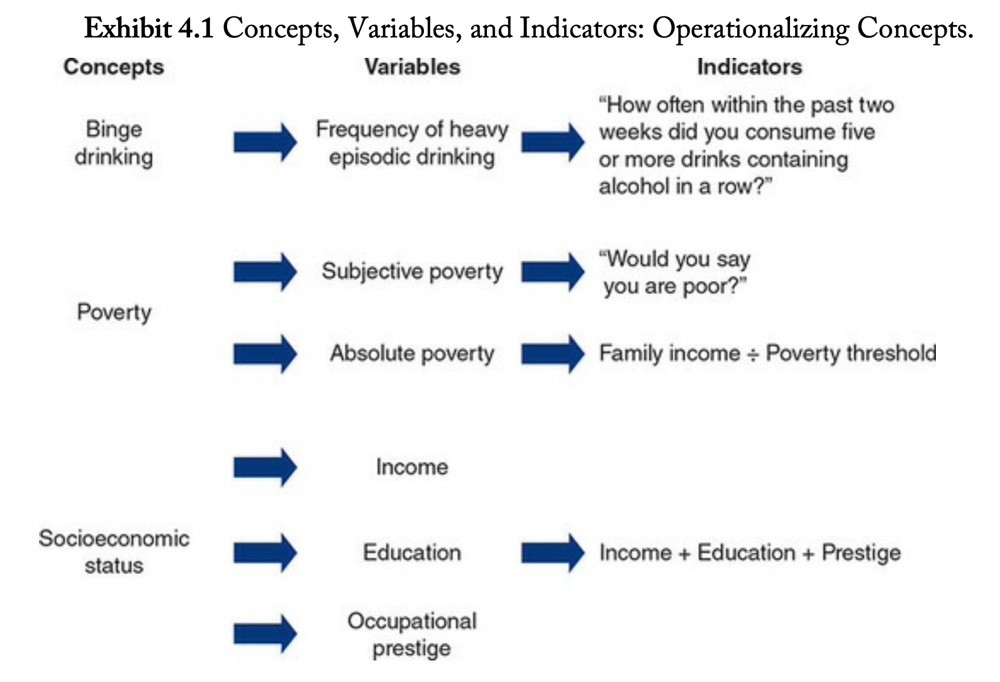
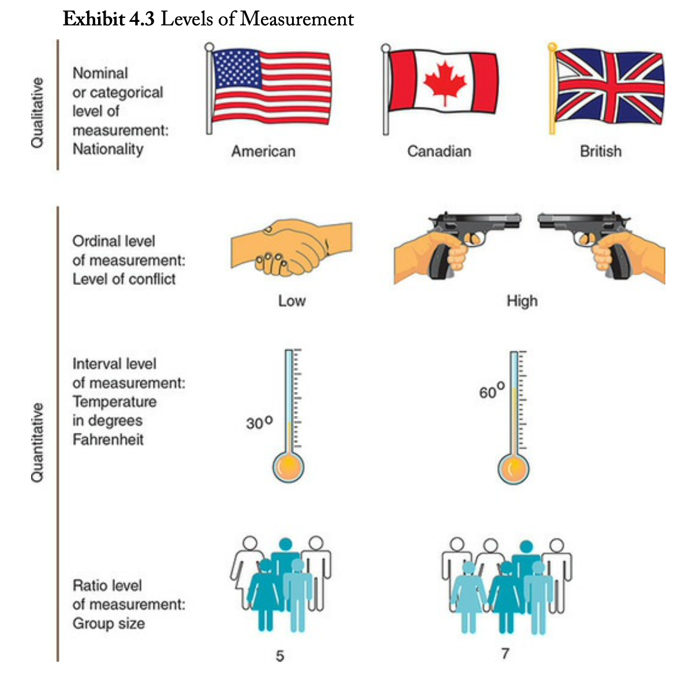
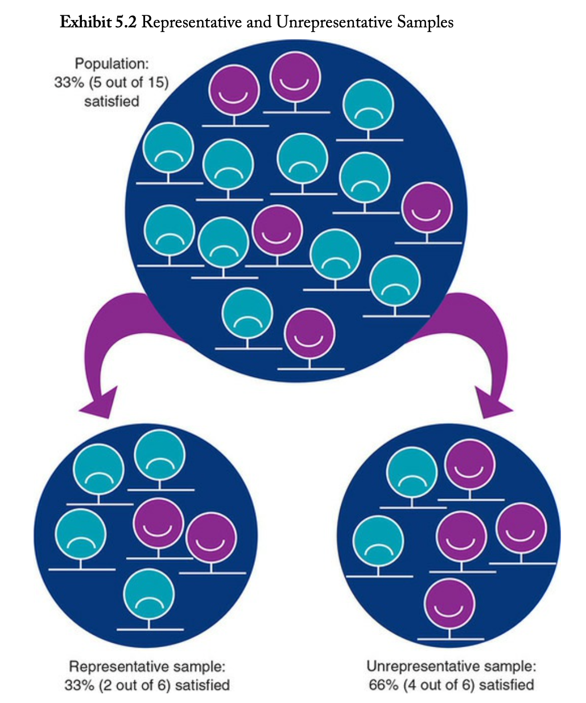
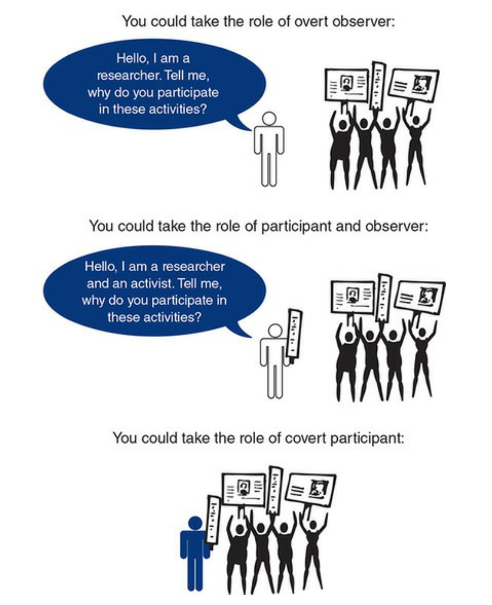
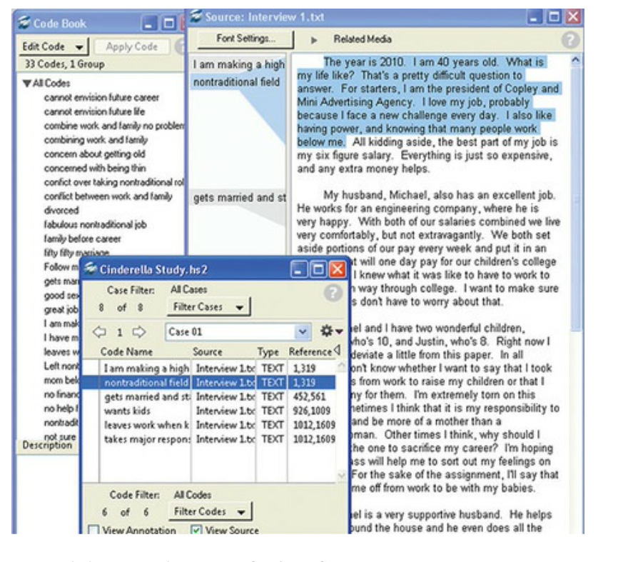

```{r setup, include=FALSE}
options(htmltools.dir.version = FALSE)
knitr::opts_chunk$set(collapse = TRUE,
                      fig.retina = 3,
                      echo = FALSE)
library(countdown)
library(ymlthis)
library(tidyverse)
library(magick)
library(icon)
library(xaringanExtra)
xaringanExtra::use_tachyons()
xaringanExtra::use_tile_view()
xaringanExtra::use_webcam()
xaringanExtra::use_fit_screen()
xaringanExtra::use_extra_styles(hover_code_line = TRUE, mute_unhighlighted_code = TRUE)
xaringanExtra::use_share_again()
xaringanExtra::use_panelset()

```

layout: true

---

class: title-slide, hide-count, center, hide-logo

background-image: url("https://images.unsplash.com/photo-1444703686981-a3abbc4d4fe3?ixid=MnwxMjA3fDB8MHxwaG90by1wYWdlfHx8fGVufDB8fHx8&ixlib=rb-1.2.1&auto=format&fit=crop&w=1770&q=80")
background-size: cover

```{r meta, echo=FALSE}
library(metathis)
meta() %>%
  meta_general(
    description = "Ajay Koli - Vishwakarma University",
    generator = "xaringan and remark.js"
  ) %>% 
  meta_name("github-repo" = "koliajaykr/plagiarism-zotero") %>% 
  meta_social(
    title = "Effective Citation & Referencing to avoid Plagiarism",
    url = "https://plag-zotero.netlify.app/",
    image = "https://plag-zotero.netlify.app/images/social-card.png",
    og_type = "talk",
    og_author = "Ajay Koli",
    twitter_card_type = "summary_large_image",
    twitter_creator = "@ajay_kolii"
  ) %>%
  include_meta()
```

<br>
<br>
<br>
# .big-text.white[`r rmarkdown::metadata$title`]

## .white.b[`r rmarkdown::metadata$subtitle`]

### .white.b[`r rmarkdown::metadata$author` | `r format(Sys.Date(), "%d %B %Y") `]

---
class: center, middle

.pull-left[
```{r , echo=FALSE, out.width="70%"}
library(magick)
magick::image_read("images/ajaykoli.png") 
```

`r icon::fa("twitter")`[@ajay_kolii](https://twitter.com/ajay_kolii) <br> 
`r icon::fa("envelope")`   [koliajaykumar@gmail.com](koliajaykumar@gmail.com)

]

.pull-right[
<br>
<br>
<br>
<br>

# Jai Bhim! `r emo::ji("blush")`
]

---

# STAR 

- STAR: Steps Towards Academic Research

--

- It is a free research methodology course as part of Corporate Social Responsibility (CSR) activity of Department of Travel & Tourism, [Vishwakarma University](https://www.vupune.ac.in/) - Pune, India, exclusively for the students of [Digital Nalanda](https://www.digitalnalanda.com/). 

--

- Its purpose is to encourage and train students to pursue research as a career.

--

- Free eBooks will be given and slides will be shared.

--

- Schedule:
  - Total sessions are eight
  - `r emo::ji("date")` 15 Dec 2021 to 07 Jan 2022; every Wednesday & Friday 
  - `r emo::ji("alarm_clock")` from 06:30 to 08:30 PM IST.

---

name: contents-slide

# Topics:

1. [Research Framework](#session1)

1. [Research Approaches](#session2)

1. [Ethics in Research](#session3)

1. [Literature Review, Measurement & Sampling](#session4)

1. [Quantitative Methods & Analysis](#session5) 

1. [Qualitative Methods & Analysis](#session6) 

---

class: middle, center

## .blue["in our everyday reasoning about the social world, prior experiences and orientations may have a major influence on what we perceive and how we interpret these perceptions.] ... 
--
.green[We need to move beyond first impressions and get reactions to more systematic methods of investigation. That’s what social research does."]<sup>2</sup>

---

# Science

- A set of logical, systematic, documented methods for investigating nature and natural processes; the knowledge produced by these investigations.<sup>2</sup>

```{r out.width="23%", fig.align='center'}
knitr::include_graphics("https://upload.wikimedia.org/wikipedia/commons/4/40/Tycho_instrument_sextant_mounting_19.jpg")
```

.footnote[
Image source: [Scientific instruments for measuring angles between two celestial bodies](https://upload.wikimedia.org/wikipedia/commons/4/40/Tycho_instrument_sextant_mounting_19.jpg)
]

---

# Social Science

- The use of scientific methods to investigate individuals, societies, and social processes; the knowledge produced by these investigations.<sup>2</sup>

```{r fig.align='center', out.width="45%"}
knitr::include_graphics("https://upload.wikimedia.org/wikipedia/commons/thumb/d/d7/1888-01-22%2C_La_Ilustraci%C3%B3n_Espa%C3%B1ola_y_Americana%2C_El_censo_de_poblaci%C3%B3n%2C_Alc%C3%A1zar.jpg/1920px-1888-01-22%2C_La_Ilustraci%C3%B3n_Espa%C3%B1ola_y_Americana%2C_El_censo_de_poblaci%C3%B3n%2C_Alc%C3%A1zar.jpg")
```

.footnote[
Image source: [Early censuses and surveys provided demographic data.](https://upload.wikimedia.org/wikipedia/commons/thumb/d/d7/1888-01-22%2C_La_Ilustraci%C3%B3n_Espa%C3%B1ola_y_Americana%2C_El_censo_de_poblaci%C3%B3n%2C_Alc%C3%A1zar.jpg/1920px-1888-01-22%2C_La_Ilustraci%C3%B3n_Espa%C3%B1ola_y_Americana%2C_El_censo_de_poblaci%C3%B3n%2C_Alc%C3%A1zar.jpg)
]


---

class: middle

background-image: url("https://media0.giphy.com/media/QvMlVkJ3XSSj9cOxDM/giphy.gif?cid=ecf05e47oubsluctl3i87lrsu1u6m58fbk4um5kjhni65zmj&rid=giphy.gif&ct=g")
background-size: 50%
background-position: 95% 50%

# Research Hell `r emo::ji("fire")` 

#  How to make it <br>`less` painful?

---

name: session1

class: title-slide, center, middle, inverse, hide-count, hide-logo

background-image: url("https://images.unsplash.com/photo-1606913079621-e64bd28682ba?ixlib=rb-1.2.1&ixid=MnwxMjA3fDB8MHxwaG90by1wYWdlfHx8fGVufDB8fHx8&auto=format&fit=crop&w=1740&q=80")
background-size: cover

<br>
<br>
<br>
<br>
<br>
<br>
<br>
<br>
<br>
<br>
<br>

# Research Framework

## Session 1

---

background-image: url("https://images.unsplash.com/photo-1517856497829-3047e3fffae1?ixid=MnwxMjA3fDB8MHxwaG90by1wYWdlfHx8fGVufDB8fHx8&ixlib=rb-1.2.1&auto=format&fit=crop&w=1738&q=80")
background-size: cover

.pull-left[
# Why research?

- "Research results in the .orange[creation of knowledge] to solve a problem, answer a question, and better describe or understand something."

.footnote[

Clough, P., & Nutbrown, C. (2012). A Student′ s Guide to Methodology. Sage. 

]

]

--

.pull-right[
# Find your reason:
  - education
  - better opportunities
  - curiosity
  - targets
  - policy critic
  - climate change
  - fame
  - human rights for all genders & castes
  - poverty alleviation
  - consumption
  - production
  - medicine
]


---
class: hide-logo

background-image: url("https://images.unsplash.com/photo-1558538337-aab544368de8?ixid=MnwxMjA3fDB8MHxwaG90by1wYWdlfHx8fGVufDB8fHx8&ixlib=rb-1.2.1&auto=format&fit=crop&w=1770&q=80")
background-size: cover

# .white.center[What is research?]
<br>
<br>
<br>
<br>
<br>
<br>
<br>
<br>
<br>
<br>

- .white[".red[is about .b[asking] questions, exploring problems] .green[and .b[reflecting] on what emerges in order to make meaning from the data] .blue[and tell the research .b[story]]"]

.footnote[

.white[Clough, P., & Nutbrown, C. (2012). A Student′ s Guide to Methodology. Sage. ]

]

---

# What is research?

- "questions about the world and a desire to accurately answer them" <sup>2</sup>

--

- "steps from broad assumptions to detailed methods of data collection, analysis, and interpretation" <sup>3</sup>

--

- "Just close your eyes for a minute and utter the word research to yourself."<sup>1</sup>

---
class: right

background-image: url("https://images.unsplash.com/photo-1490818387583-1baba5e638af?ixid=MnwxMjA3fDB8MHxwaG90by1wYWdlfHx8fGVufDB8fHx8&ixlib=rb-1.2.1&auto=format&fit=crop&w=1632&q=80")
background-size: cover
background-position: 

# Let's cook some research `r emo::ji("man_cook")`

--

###- What to cook? <br>.green[Introduction + Literature review]

--

###- How to cook? <br>.green[Methodology]

--

###- What is the result of your cooking? <br>.green[Data analysis]

--

###- How similar or different is your dish? <br>.green[Discussion]

--

###-  So what, you cooked this dish `(shit)`? <br>.green[Conclusion]

---

# Social science methods help to avoid<sup>2</sup> :

-  `Overgeneralization:` Occurs when we unjustifiably conclude that what is true for some cases is true for all cases

--

- `Selective or Inaccurate Observation:` Choosing to look only at things that are in line with our preferences or beliefs.

--

-  `Illogical reasoning:` The premature jumping to conclusions or arguing on the basis of invalid assumptions.

--

- `Resistance to change:` The reluctance to change our ideas in light of new information.

---

# Social science methods help to avoid<sup>2</sup> :

.pull-left[
-  `Overgeneralization` 

- `Selective or Inaccurate Observation` 

-  `Illogical reasoning`

- `Resistance to change`
]

.pull-right[
```{r error-img, out.width="100%", fig.align='center'}
knitr::include_graphics("images/error.png")
```
]
---

# Four goals of social research are<sup>2</sup>:

1. `Description:` Research in which social phenomena are defined and described.

--

1. `Exploration:` Seeks to find out how people get along in the setting under question, what meanings they give to their actions, and what issues concern them. 

--

1. `Explanation:` Seeks to identify causes and effects of social phenomena and to predict how one phenomenon will change or vary in response to variation in another phenomenon.

--

1. `Evaluation:` Research that describes or identifies the impact of social policies and programs.

---

# How well have we done our research?

- `Validity:` The state that exists when statements or conclusions about empirical reality are correct.

--

- Three kinds of validity:
  - `Measurement validity`: Exists when an indicator measures what we think it measures.

--

  - `Causal validity` (Internal validity): Exists when a conclusion that A leads to, or results in, B is correct.
  
--

  - `Generalizability`: Exists when a conclusion holds true for the population, group, settings, or event that we say it does, given the conditions that we specify; it is the extent to which a study can inform us about persons, places, or events that were not directly studies.


---
class: middle

.pull-left[
<br>
<br>
<br>
# .center[Generalizability]

`Sample generalizability:` Exists when a conclusion based on a sample, or subset, of a larger population holds true for that population.
]

.pull-right[
```{r fig.align='center'}
knitr::include_graphics("images/sample-pop.png")
```
]

---
class: middle

.pull-left[
# .center[Generalizability]

`Cross-population generalizability (external validity):`
Exists when findings about one group, population, or setting hold true for other groups, populations, or settings.
]

.pull-right[
```{r fig.align='center'}
knitr::include_graphics("images/cross-pop.png")
```
]

---

# What did we learn?

## `r emo::ji("check")` Why you want to do research?

--

## `r emo::ji("check")` So what? `r emo::ji("smirk")`

--

## `r emo::ji("check")` Validity of your research `r emo::ji("balance_scale")`

---

name: session2

class: title-slide, center, middle, inverse, hide-count, hide-logo

background-image: url("https://images.unsplash.com/photo-1457364887197-9150188c107b?ixlib=rb-1.2.1&ixid=MnwxMjA3fDB8MHxwaG90by1wYWdlfHx8fGVufDB8fHx8&auto=format&fit=crop&w=1770&q=80")
background-size: cover
background-position:

# .white[Research Approaches]
## .white[Session 2]

---

# Outcomes:

- Determining your research approach

--

- Identifying a worldview with which you are most comfortable

--

- Defining the three types of research approaches

--

- Using quantitative, qualitative, and mixed methods designs and methods

.footnote[
This session slides are prepared from Chapter 1 of Creswell, J. W., & Creswell, J. D. (2017). Research design: Qualitative, quantitative, and mixed methods approaches. Sage publications. 
]

---

# Research approach

- "Research approaches are **plans and the procedures** for research that span the steps from broad assumptions to
detailed methods of data collection, analysis, and interpretation."

---

# Three research approaches are: 

.pull-left[
1. Qualitative

1. Quantitative, and

1. Mixed methods.
]

.pull-right[
<blockquote class="twitter-tweet"><p lang="en" dir="ltr">Qualitative methods, mixed methods, quantitative methods. <a href="https://t.co/6iv8izV6Ag">pic.twitter.com/6iv8izV6Ag</a></p>&mdash; Dr Raul Pacheco-Vega (@raulpacheco) <a href="https://twitter.com/raulpacheco/status/1458808875222802433?ref_src=twsrc%5Etfw">November 11, 2021</a></blockquote> <script async src="https://platform.twitter.com/widgets.js" charset="utf-8"></script> 
]

---

# Qualitative approach

- "using .red[words]"

--

- "is an approach for exploring and understanding <br>the .red[meaning] individuals or groups ascribe <br>to a social or human problem."

--

- open-ended questions and responses

--

- .red[flexible] report structure


---

background-image: url("https://thecolumnofcurae.files.wordpress.com/2020/07/23selvaratnam-mobilemasterat3x.jpg")
background-size: 35%
background-position: 99% 50% 

# Qualitative approach

- "using .red[words]"

- "is an approach for exploring and understanding <br>the .red[meaning] individuals or groups ascribe <br>to a social or human problem."

- open-ended questions and responses

- .red[flexible] report structure

- for example .red[violence]

---

background-image: url("https://static.vecteezy.com/system/resources/previews/002/715/966/non_2x/exhausted-tired-male-manager-in-office-sad-sitting-with-head-down-burnout-concept-illustration-with-exhausted-man-office-worker-sitting-at-the-table-stressful-work-stress-at-workplace-vector.jpg")
background-size: 35%
background-position: 99% 50% 

# Qualitative approach

- "using .red[words]"

- "is an approach for exploring and understanding <br>the .red[meaning] individuals or groups ascribe <br>to a social or human problem."

- open-ended questions and responses

- .red[flexible] report structure

- for example .red[work burnout]

---

background-image: url("https://www.mercedes-benz.com/en/lifestyle/studio-odeonsplatz/_jcr_content/image/MQ6-8-image-20211011170412/Studio-Odeonsplatz-The-Design-Edit-EQS-450-2560x1440.jpeg")
background-size: 40%
background-position: 99% 50% 

# Qualitative approach

- "using .red[words]"

- "is an approach for exploring and understanding <br>the .red[meaning] individuals or groups ascribe <br>to a social or human problem."

- open-ended questions and responses

- .red[flexible] report structure

- for example .red[luxury purchase]

---

# Quantitative approach

- "use .red[numbers]"

--

- "is an approach for testing objective theories <br>by examining relationship among .red[variables]"

--

- closed-ended questions and responses

--

- set structure

---

background-image: url("https://www.usnews.com/dims4/USNEWS/efd80bb/2147483647/thumbnail/640x420/quality/85/?url=http%3A%2F%2Fmedia.beam.usnews.com%2Fcb%2F24%2Fa96fd5194c44b9db58b0d9d835f3%2F160728-videogameviolence-stock.jpg")
background-size: 40%
background-position: 99% 50%

# Quantitative approach

- "use .red[numbers]"

- "is an approach for testing objective theories <br>by examining relationship among .red[variables]"

- closed-ended questions and responses

- set structure

- example .red[games & violence]

---

background-image: url("https://us.123rf.com/450wm/samwordley/samwordley1905/samwordley190500204/122062853-addicted-man-chatting-and-surfing-on-the-internet-with-smart-phone-late-at-night-in-bed-bored-sleepl.jpg?ver=6")
background-size: 40%
background-position: 99% 50%

# Quantitative approach

- "use .red[numbers]"

- "is an approach for testing objective theories <br>by examining relationship among .red[variables]"

- closed-ended questions and responses

- set structure

- example .red[mobile and sleep disorder]

---

background-image: url("https://cbk.bschool.cuhk.edu.hk/wp-content/uploads/shutterstock_1723731022.jpg")
background-size: 40%
background-position: 99% 50%

# Quantitative approach

- "use .red[numbers]"

- "is an approach for testing objective theories <br>by examining relationship among .red[variables]"

- closed-ended questions and responses

- set structure

- example .red[shelf management]

---

# Mixed methods approach

- "an approach to inquiry involving collecting <br>.red[ both] quantitative and qualitative data, <br>.red[integrating the two] forms of data, and <br>using distinct designs that may involve <br>philosophical assumptions and <br>theoretical frameworks."

---

background-image: url("https://external-content.duckduckgo.com/iu/?u=https%3A%2F%2Fwww.thehoopsnews.com%2Fwp-content%2Fuploads%2F2015%2F11%2Fgender-gap-alcohol-consumption-960x540.jpg&f=1&nofb=1")
background-size: 40%
background-position: 99% 50%

# Mixed methods approach

- "an approach to inquiry involving collecting <br>.red[ both] quantitative and qualitative data, <br>.red[integrating the two] forms of data, and <br>using distinct designs that may involve <br>philosophical assumptions and <br>theoretical frameworks."


- Example .red[gender & alcohol]

.footnote[
Paper link https://www.tandfonline.com/doi/abs/10.1080/08870446.2011.617444
]

---

background-image: url("https://static.toiimg.com/photo/msid-73140552/73140552.jpg?1229324")
background-size: 40%
background-position: 99% 50%

# Mixed methods approach

- "an approach to inquiry involving collecting <br>.red[ both] quantitative and qualitative data, <br>.red[integrating the two] forms of data, and <br>using distinct designs that may involve <br>philosophical assumptions and <br>theoretical frameworks."


- Example .red[student anxiety]

.footnote[
Paper link https://journals.sagepub.com/doi/abs/10.1177/0193945911408444
]

---

background-image: url("https://marriageandfamilyonlineconferences.files.wordpress.com/2010/02/family.jpg")
background-size: 40%
background-position: 99% 50%

# Mixed methods approach

- "an approach to inquiry involving collecting <br>.red[ both] quantitative and qualitative data, <br>.red[integrating the two] forms of data, and <br>using distinct designs that may involve <br>philosophical assumptions and <br>theoretical frameworks."


- Example .red[family formation]

.footnote[
Paper link https://journals.sagepub.com/doi/abs/10.1177/2345678906292238
]

---

# Research approach depends upon:

- `Philosophical world-view`: a general philosophical orientation about the world and the nature of research that a researcher brings to a study

--

- `Research designs`: procedures of inquiry as per the philosophical assumptions

--

- `Research methods`<sup>1</sup> of data collection, analysis and interpretation


.footnote[
[1] Research methodology is different from research methods. `r emo::ji("exploding_head")`
]

---
class: center

# A Framework for Research

The Interconnection of World-views, Research Designs, & Research Methods
<br>
<br>
<br>
```{r}
knitr::include_graphics("https://www.researchgate.net/profile/Steve-Phillips-3/publication/327832478/figure/fig2/AS:674025185480712@1537711535595/A-Framework-for-Research-The-Interconnection-of-Worldviews-Design-and-Research-Methods.jpg")
```

---

# Philosophical Worldviews

.pull-left[
## .orange[Postpositivism]

- Determination (cause & effect)

- Reductionism (idea -> variables -> hypothesis   )

- Empirical observation and measurement

- Theory verification
]

.pull-right[
```{r}
knitr::include_graphics("https://www.researchgate.net/profile/Steve-Phillips-3/publication/327832478/figure/fig2/AS:674025185480712@1537711535595/A-Framework-for-Research-The-Interconnection-of-Worldviews-Design-and-Research-Methods.jpg")
```
]

---

# Philosophical Worldviews

.pull-left[
## .orange[Constructivist]

- Understanding

- Multiple participant meanings

- Social & historical construction

- Theory generation
]

.pull-right[
```{r}
knitr::include_graphics("https://www.researchgate.net/profile/Steve-Phillips-3/publication/327832478/figure/fig2/AS:674025185480712@1537711535595/A-Framework-for-Research-The-Interconnection-of-Worldviews-Design-and-Research-Methods.jpg")
```
]

---

# Philosophical Worldviews

.pull-left[
## .orange[Transformative]

- Political

- Power & justice oriented

- Collaborative

- Change-oriented
]

.pull-right[
```{r}
knitr::include_graphics("https://www.researchgate.net/profile/Steve-Phillips-3/publication/327832478/figure/fig2/AS:674025185480712@1537711535595/A-Framework-for-Research-The-Interconnection-of-Worldviews-Design-and-Research-Methods.jpg")
```
]

---

# Philosophical Worldviews

.pull-left[
## .orange[Pragmatic]

- Consequence of actions

- Problem-centered

- Pluralistic

- Real-world practice oriented
]

.pull-right[
```{r}
knitr::include_graphics("https://www.researchgate.net/profile/Steve-Phillips-3/publication/327832478/figure/fig2/AS:674025185480712@1537711535595/A-Framework-for-Research-The-Interconnection-of-Worldviews-Design-and-Research-Methods.jpg")
```
]

---

# Research Designs

- "are types of inquiry within qualitative, quantitative, and mixed methods approaches that provide specific direction for procedures in a research designs"

--

.panelset[
.panel[.panel-name[Quantitative]

- Experimental designs

- Non-experimental designs, such a surveys
]

.panel[.panel-name[Qualitative]

- Narrative research

- Phenomenology

- Grounded theory

- Ethnographies

- Case study
]

.panel[.panel-name[Mixed Methods]

- Convergent

- Explanatory sequential

- Exploratory sequential

- Transformative, embedded , or multiphase

]
]

---

# Research Methods

- "involve the forms of data collection, analysis, and interpretation that researchers propose for their studies"

--

.panelset[
.panel[.panel-name[Quantitative Methods]

- Pre-determined

- Instrument based questions

- Performance data, attitude data, observational data, & census data

- Statistical analysis

- Statistical interpretation
]

.panel[.panel-name[Qualitative]

- Emerging methods

- Open-ended questions

- Interview data, observation data, document data & audiovisual data

- Test & image analysis

- Themes, patterns interpretation

]

.panel[.panel-name[Mixed Methods]

- Both predetermined & emerging methods

- Both open- and closed- ended questions

- Multiple forms of data drawing on all possibilities

- Statistical & text analysis

- Across databases interpretation

]

]

---

## Research Approaches as Worldviews, Designs, and Methods

- `Quantitative approach`: Postpositivist worldview, experimental design, and pretest and posttest measures of attitudes

--

- `Qualitative approac`h: Constructivist worldview, ethnographic design, and observation of behavior

--

- `Mixed methods approach`: Pragmatic worldview, collection of both quantitative and qualitative data sequentially in the design

---

## Criteria for Selecting a Research Approach

- The Research Problem and Questions

--

- Personal training & experiences

--

- Audience

---

name: session3
color: black

class: title-slide, center, middle, inverse, hide-count, hide-logo

background-image: url("https://images.unsplash.com/photo-1450849608880-6f787542c88a?ixlib=rb-1.2.1&ixid=MnwxMjA3fDB8MHxwaG90by1wYWdlfHx8fGVufDB8fHx8&auto=format&fit=crop&w=2842&q=80")
background-size: cover
background-position: 

# .white[Ethics in Research]

## .white[Session 3]

---

class: center

# Historical Background

.pull-left[
### .orange[Nuremberg war crime trials (1946)]

```{r out.width="55%"}
knitr::include_graphics("https://upload.wikimedia.org/wikipedia/commons/6/6b/Pressurization_experiment_at_Dachau.jpg")
```

]

--

.pull-right[
### .orange[Tuskegee syphilis study <br>(1932–1972)]

```{r out.width="75%"}
knitr::include_graphics("https://upload.wikimedia.org/wikipedia/commons/thumb/3/3a/Tuskegee-syphilis-study_doctor-injecting-subject.jpg/1920px-Tuskegee-syphilis-study_doctor-injecting-subject.jpg")
```
]
---

# Three basic ethical principles:

1. `Respect for persons` - treating persons as autonomous agents and protecting those with diminished autonomy

--

1. `Beneficence` - minimizing possible harms and maximizing benefits.

--

1. `Justice` - distributing benefits and risks of research fairly

.footnote[
This session slides are prepared using Chapter 3 from Chambliss, D. F., & Schutt, R. K. (2018). Making sense of the social world: Methods of investigation. Sage Publications.
]

---

# Code of Ethics of the ASA

1. To protect reserach subjects

--

1. To maintain honesty and openness

--

1. To achieve valid results

--

1. To encourage appropriate application

.footnote[
ASA: American Sociological Association
]

---

# Protecting Research Subjects

1. Avoid harming research participants.

--

1. Obtain informed consent.

--

1. Avoid deception in research, except in limited circumstances.

--

1. Maintain privacy & confidentiality.

---

# Reporting, Sharing & Storing Data

1. Falsifying authorship, evidence, data findings or conclusions.

--

1. Do not plagiarize

--

1. Communicate in clear straightforward, appropriate language

--

1. Share data with others

--

1. Keep raw data and other materials

--

1. Do not duplicate publication


---

name: session4

class: title-slide, center, middle, inverse, hide-count, hide-logo

background-image: url("https://images.unsplash.com/photo-1445905595283-21f8ae8a33d2?ixlib=rb-1.2.1&ixid=MnwxMjA3fDB8MHxwaG90by1wYWdlfHx8fGVufDB8fHx8&auto=format&fit=crop&w=1773&q=80")
background-size: cover
background-position: 

# .white[Literature Review, <br>Measurement & Sampling]

## .white[Session 4]

---
class: hide-logo, hide-count

.pull-left[
<br>
<br>
<br>
<br>
<br>
# Literature Review
]

.pull-right[
<blockquote class="twitter-tweet"><p lang="en" dir="ltr">Search for that one reason/sentence while writing. <a href="https://twitter.com/hashtag/AcademicTwitter?src=hash&amp;ref_src=twsrc%5Etfw">#AcademicTwitter</a> <a href="https://twitter.com/OpenAcademics?ref_src=twsrc%5Etfw">@OpenAcademics</a> <a href="https://twitter.com/PhDVoice?ref_src=twsrc%5Etfw">@PhDVoice</a> <a href="https://twitter.com/PhD_Genie?ref_src=twsrc%5Etfw">@PhD_Genie</a> <a href="https://t.co/DzaYRY8Acr">pic.twitter.com/DzaYRY8Acr</a></p>&mdash; Dr. Imran Farooq (@drimran_farooq) <a href="https://twitter.com/drimran_farooq/status/1472660535284051972?ref_src=twsrc%5Etfw">December 19, 2021</a></blockquote> <script async src="https://platform.twitter.com/widgets.js" charset="utf-8"></script> 
]

.footnote[
Slide source Chapter 2 from the book Creswell, J. W., & Creswell, J. D. (2017). Research design: Qualitative, quantitative, and mixed methods approaches. Sage publications.
]

---

# The Research Topic

- "the central idea to learn about or to explore"

--

- My study is about ...

--

- Pose the topic as a brief question:

  - What treatment is best for depression?
  - What does it mean to be Dalit in Indian society today?
  - What brings people to cities in India?

---

# The Research Topic

### .orange[a new perspective or “angle” to the existing literature]

--

  - Studying an unusual location (e.g., caste in America)

--
  
  - Examining an unusual group of participants (e.g., refugees)

--

  - Taking a perspective that may not be expected and reverses the expectation (e.g., why marriages do work rather than do not work)
  
--

  - Providing novel means of collecting data (e.g., collect sounds)
  
--

  - Presenting results in unusual ways (e.g., graphs that depict geographical locations)
  
--

  - Studying a timely topic (e.g., agriculture laws, Dalits in Indian cinema)

---

# Social research question:

A question about the social world that is answered through the collection and analysis of first-hand, verifiable, empirical data.

---

# "Good" research question:

- `Feasibility` - Can you start and finish an investigation of your research question with available resources and in the time allotted?

--

- `Social importance` - Will an answer to your research question make a difference in the social world, even if it only helps people understand a problem they consider important? 

--

- `Scientific relevance` - Does your research question help resolve some contradictory research findings or a puzzling issue in social theory?

---

# Literature Review

- "literature review helps to determine whether the topic is .orange[worth studying], and it provides insight into ways in which the researcher can .orange[limit the scope] to a needed area of inquiry."

--

- "to consider whether the .orange[research topic] can and should be researched"

---

# Purposes of Literature Review:

- It shares with the reader the results of other studies that are .orange[closely related] to the one being undertaken. 

--

- It relates a study to the larger, .orange[ongoing dialogue] in the literature, filling in gaps and extending prior studies

--

- It provides a framework for establishing the importance of the study as well as a benchmark for .orange[comparing the results] with other findings.

---

# Four types of literature reviews are:

1. Integrate what others have done and said,

--

1. Criticize previous scholarly works, 

--

1. Build bridges between related topics, and 

--

1. Identify the central issues in a field.

---

# Conducting a Literature Review

1. Begin by identifying key words

--

1. Searching the databases like [Google Scholar](https://scholar.google.com/), Web of Science, EBSCO, ProQuest, and JSTOR or you can also use website like [Library Genesis](https://libgen.is/) to download books and papers.

--

1. Skim this initial group of articles or chapters, and collect those that are central to your topic.

--

1. Designing a .orange[literature map] ... a visual picture of groupings of the literature on the topic that illustrates how your particular study will add to the existing literature and position your study within the larger body of research.

---

# Tools for Literature Review

.pull-left[
<blockquote class="twitter-tweet"><p lang="en" dir="ltr">Academic writing is wild bc you’ll read four articles just to write one sentence. <br><br>Anyway, here’s a thread of resources I’ve been using to speed through this review I’m working on:</p>&mdash; Anicca Harriot🔬 (@13adh13) <a href="https://twitter.com/13adh13/status/1406664117147123715?ref_src=twsrc%5Etfw">June 20, 2021</a></blockquote> <script async src="https://platform.twitter.com/widgets.js" charset="utf-8"></script> 
]

--

.pull-right[

1. [Connected Papers](https://www.connectedpapers.com/)

1. [Open knowledge map](https://openknowledgemaps.org/index)

1. [Scholarcy plug-in for Chrome](https://chrome.google.com/webstore/detail/scholarcy-research-paper/oekgknkmgmaehhpegfeioenikocgbcib?hl=en-GB)

1. [Speechify app](https://speechify.com/)

1. [Scite](https://scite.ai/)

]

---

class: hide-count, hide-logo, middle

background-image: url("https://images.unsplash.com/photo-1562386502-cc212ede3c40?ixlib=rb-1.2.1&ixid=MnwxMjA3fDB8MHxwaG90by1wYWdlfHx8fGVufDB8fHx8&auto=format&fit=crop&w=790&q=80")
background-size: 50%
background-position: 100% 50%

# .left[Measurement]

---

# Concept

- A mental image that summarizes a set of similar observations, feelings, or ideas.

--

- Defining concepts clearly can be difficult because many concepts have several meanings and can be measured in many ways. Example family, caste, social capital etc.

--

- .orange[Conceptualization]: working out what your key terms will mean in your research - is a crucial part of the research process.

.footnote[
Slides from chapter 4 from book Chambliss, D. F., & Schutt, R. K. (2018). Making sense of the social world: Methods of investigation. Sage Publications.
]

---

# Variable

- A characteristic or property that can vary (take on different values or attributes).

---

# Steps to find variables:

1. .orange[Examine the theories] that are relevant to our research question to identify those concepts that would be expected to have some bearing on the phenomenon we are investigating.

--

1. .orange[Review the relevant research literature], and assess the utility of variables used in prior research.

--

1. .orange[Consider the constraints and opportunities] for measurement that are associated with the specific setting(s) we will study. 
--

1. .orange[Look ahead to our analysis] of the data. What role will each variable play in our analysis?

---

class: center, middle

```{r}

```

---

# Four levels of measurement: 

1. Nominal, 

1. Ordinal, 

1. Interval, and 

1. Ratio.


---

class: center, middle

```{r}

```

---

# Levels of Measurement:

1. .orange[Nominal level of measurement]: Variables whose values have no mathematical interpretation; they vary in kind or quality but not in amount.

--

1. .orange[Ordinal level of measurement]:
A measurement of a variable in which the numbers indicating a variable’s values specify only the order of the cases, permitting greater than and less than distinctions.

--

1. .orange[Interval level of measurement]: A measurement of a variable in which the numbers indicating a variable’s values represent fixed measurement units but have no absolute, or fixed, zero point.

--

1. .orange[Ratio level of measurement]: A measurement of a variable in which the numbers indicating the variable’s values represent fixed measuring units and an absolute zero point.

---

class: hide-count, hide-logo, middle

background-image: url("https://images.unsplash.com/photo-1596272983839-ce0e5a1f5485?ixlib=rb-1.2.1&ixid=MnwxMjA3fDB8MHxwaG90by1wYWdlfHx8fGVufDB8fHx8&auto=format&fit=crop&w=930&q=80")
background-size: 50%
background-position: 100% 50% 

# .left[Sampling]

---

##- “You don’t have to eat the whole tub of butter to know if it’s rancid.” Harsh, but true.

--

##- That is the essence of sampling: A small portion, carefully chosen, can reveal the quality of a much larger whole.

--

##- Sampling techniques tell us how to select cases that can lead to valid generalizations about a population

.footnote[
Slides from chapter 5 from book Chambliss, D. F., & Schutt, R. K. (2018). Making sense of the social world: Methods of investigation. Sage Publications.
]

---

#  Population:

- The entire set of individuals or other entities to which study findings are to be generalized.

--

## Sample:

- A subset of a population used to study the population as a whole.

--

### .orange[Sampling Bias] 

- Sampling bias occurs when some population characteristics are overrepresented or underrepresented in the sample because of particular features of the method of selecting the sample.

---

class: hide-logo

```{r fig.align='center'}

```


---

# Assess the Diversity of the Population

- Sampling is unnecessary if all the units in the population are identical.

--

- .orange[Representative sample]: A sample that “looks like” the population from which it was selected in all respects that are potentially relevant to the study. The distribution of characteristics among the elements of a representative sample is the same as the distribution of those characteristics among the total population. In an unrepresentative sample, some characteristics are overrepresented or underrepresented.

--

- .orange[Consider a Census]: Research in which information is obtained through responses from or information about all available members of an entire population.

---

# What sampling method should we use?

.pull-left[
## Probability sampling methods:

- Sampling methods that rely on a random, or chance, selection method so that the probability of selection of population elements is known.

]

--

.pull-right[
## Nonprobability sampling methods:

- Sampling methods in which the probability of selection of population elements is unknown.
]

---

# Probability sampling methods:

1. Simple random sampling,

1. Systematic random sampling,

1. Cluster sampling, and

1. Stratified random sampling.

---

### .orange[Probability sampling methods]

# Simple random sampling:

- A method of sampling in which every sample element is selected purely on the basis of chance through a random process.

```{r echo=FALSE, fig.align='center', out.width="50%"}
knitr::include_graphics("https://www.questionpro.com/blog/wp-content/uploads/2018/03/Simple-random-sampling-wt-logo.jpg")
```

---

### .orange[Probability sampling methods]

# Systematic random sampling:

- A method of sampling in which sample elements are selected from a list or from sequential files, with every nth element being selected after the first element is selected randomly.

```{r echo=FALSE, fig.align='center', out.width="45%"}
knitr::include_graphics("https://www.questionpro.com/blog/wp-content/uploads/2018/03/2.jpg")
```


---

### .orange[Probability sampling methods]

# Cluster sampling

- Sampling in which elements are selected in two or more stages, with the first stage being the random selection of naturally occurring clusters and the last stage being the random selection of elements within clusters.

```{r echo=FALSE, fig.align='center', out.width="50%"}
knitr::include_graphics("https://www.voxco.com/wp-content/uploads/2021/03/Cluster-Sampling-21.png")
```


---

### .orange[Probability sampling methods]

# Stratified random sampling

- A method of sampling in which sample elements are selected separately from population strata that the researcher identifies in advance

```{r echo=FALSE, fig.align='center', out.width="50%"}
knitr::include_graphics("https://www.questionpro.com/blog/wp-content/uploads/2018/03/1-1.jpg")
```

---

# Nonprobability sampling methods:

1. Availability sampling, 

1. Quota sampling, 

1. Purposive sampling, and 

1. Snowball sampling.

---

### .orange[Nonprobability sampling methods]

# Convenience/Availability sampling 

- Sampling in which elements are selected on the basis of convenience.

```{r echo=FALSE, fig.align='center', out.width="60%"}
knitr::include_graphics("https://img.favpng.com/21/17/9/simple-random-sample-convenience-sampling-stratified-sampling-png-favpng-4dMMGGKQCgP1Q4J1KBKDmUp2u.jpg")
```


---

### .orange[Nonprobability sampling methods]

# Quota sampling

- A nonprobability sampling method in which elements are selected to ensure that the sample represents certain characteristics in proportion to their prevalence in the population.

```{r echo=FALSE, fig.align='center', out.width="60%"}
knitr::include_graphics("https://images.deepai.org/glossary-terms/1d26bd13f5af4c7f9b475c5bb4bf8812/65-Quota-Sampling.jpg")
```

---

### .orange[Nonprobability sampling methods]

# Purposive sampling

- A nonprobability sampling method in which elements are selected for a purpose, usually because of their unique position.

```{r echo=FALSE, fig.align='center', out.width="55%"}
knitr::include_graphics("https://rm-15da4.kxcdn.com/wp-content/uploads/2012/06/Purposive-sampling.jpg")
```

---

### .orange[Nonprobability sampling methods]

# Snowball sampling

- A method of sampling in which sample elements are selected as successive informants or interviewees identify them.

```{r echo=FALSE, fig.align='center', out.width="55%"}
knitr::include_graphics("https://www.questionpro.com/blog/wp-content/uploads/2018/08/Snowball-Sampling_V01.jpg")
```

---

name: session5

class: title-slide, center, middle, inverse, hide-count, hide-logo

background-image: url("https://images.unsplash.com/photo-1611077544775-6e72542a206f?ixlib=rb-1.2.1&ixid=MnwxMjA3fDB8MHxwaG90by1wYWdlfHx8fGVufDB8fHx8&auto=format&fit=crop&w=1578&q=80")
background-size: cover

# Quantitative Methods & Analysis
## Session 5 
<br>
---

# Survey research 

It collects information from a sample of individuals through their responses to standardized
questions.

--

# Survey Designs

1. Mailed surveys

1. Phone surveys

1. In-person surveys, and

1. Electronic (especially web) surveys

---

# Statistic:

- A numerical description of some feature of a variable or variables in a sample from a larger population.

--

.pull-left[
## Descriptive statistics:

- Statistics used to describe the distribution of and relationship among variables.
]

--

.pull-right[
## Inferential statistics:

- Statistics used to estimate how likely it is that a statistical result based on data from a random sample is representative of the population from which the sample is assumed to have been selected
]

---

#  Data cleaning:

- The process of checking data for errors after the data have been entered in a computer file.

--

- Missing values

--

- Outlier: An exceptionally high or low value in a distribution.

---

# Descriptive Statistics

- Central tendency; mean, median and mode values

--

- Variability; standard deviation

--

- Skewness

```{r echo=FALSE, fig.align='center', out.width="55%"}
knitr::include_graphics("https://upload.wikimedia.org/wikipedia/commons/thumb/f/f8/Negative_and_positive_skew_diagrams_%28English%29.svg/446px-Negative_and_positive_skew_diagrams_%28English%29.svg.png")
```

---

# Data Visualisation

- Bar chart: A graphic for qualitative variables in which the variable’s distribution is displayed with solid bars separated by spaces.

--

- Histogram: A graphic for quantitative variables in which the variable’s distribution is displayed with adjacent bars.


---

# Association/Correlation:

- A criterion for establishing a causal relationship between two variables: Variation in one variable is empirically related to variation in another variable.

--

# Causal effect

The finding that change in one variable leads to change in another variable

---

name: session6

class: title-slide, center, middle, inverse, hide-count, hide-logo

background-image: url("https://images.unsplash.com/photo-1540634759006-203f597e1a34?ixlib=rb-1.2.1&ixid=MnwxMjA3fDB8MHxwaG90by1wYWdlfHx8fGVufDB8fHx8&auto=format&fit=crop&w=982&q=80")
background-size: cover

# .white[Qualitative Methods & Analysis]
## .white[Session 6]
<br>
<br>
<br>
<br>

---

# Qualitative methods:

- Methods, such as participant observation, intensive interviewing, and focus groups, that are designed to capture social life as participants experience it rather than in categories the researcher predetermines. 

--

- These methods typically involve .orange[exploratory research questions], inductive reasoning, an orientation to social context, and a focus on .orange[human subjectivity] and the meanings participants attach to events and to their lives.

---

# Ethnography:

- The study and systematic recording of human cultures.

```{r out.width="35%", fig.align='center'}
knitr::include_graphics("https://ocw.mit.edu/courses/science-technology-and-society/sts-360-ethnography-spring-2003/sts-360s03.jpg")
```

---

# Participant observation:
- A qualitative method for gathering data that involves developing a sustained relationship with people while they go about their normal activities.

```{r out.width="33%", fig.align='center'}

```

---

## Intensive (depth) interviewing:

- A qualitative method that involves open-ended, relatively unstructured questioning in which the interviewer seeks in-depth information on the interviewee’s feelings, experiences, and perceptions.

--

## Focus groups:

- A qualitative method that involves unstructured group interviews in which the focus group leader actively encourages discussion among participants on the topics of interest.

---

# Qualitative data analysis:

- Techniques used to search and code textual, aural, and pictorial data and to explore relationships among the resulting categories.

---

# Most approaches to qualitative data analysis take five steps:

1. Documentation of the data and data collection

--

1. Conceptualization and coding

--

1. Examining relationships to show how one concept may influence another

--

1. Authenticating conclusions by evaluating alternative explanations, disconfirming evidence, and searching for negative cases

--

1. Reflexivity

---

## Computer-assisted qualitative data analysis:

- Analysis of textual, aural, or pictorial data using a special computer program that facilitates searching and coding text.

```{r fig.align='center', out.width="45%"}

```

---

# References

1. Babbie, E. R. (2020). The practice of social research. Cengage learning. 

1. Chambliss, D. F., & Schutt, R. K. (2018). Making sense of the social world: Methods of investigation. Sage Publications.

1. Creswell, J. W., & Creswell, J. D. (2017). Research design: Qualitative, quantitative, and mixed methods approaches. Sage publications.

1. Sekaran, U., & Bougie, R. (2019). Research methods for business: A skill building approach. John Wiley & Sons.

1. Most of the images are from website [Unsplash](https://unsplash.com/) and few from internet.

---

class: center, middle, hide-count, hide-logo

background-image: url("https://upload.wikimedia.org/wikipedia/commons/thumb/c/c3/Dr._Bhimrao_Ambedkar.jpg/440px-Dr._Bhimrao_Ambedkar.jpg")
background-size: 
background-position: left

## .b.right["Educate. Agitate. Organise."]
### .right[[Dr B. R. Ambedkar](https://en.wikipedia.org/wiki/B._R._Ambedkar)]
### .right[Thank you]
